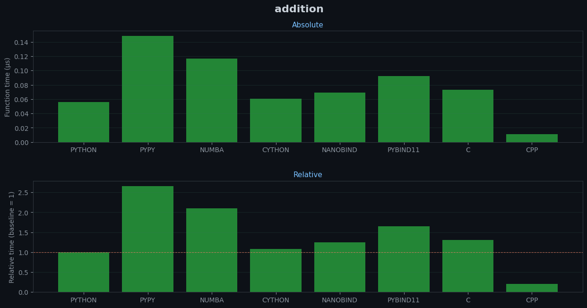
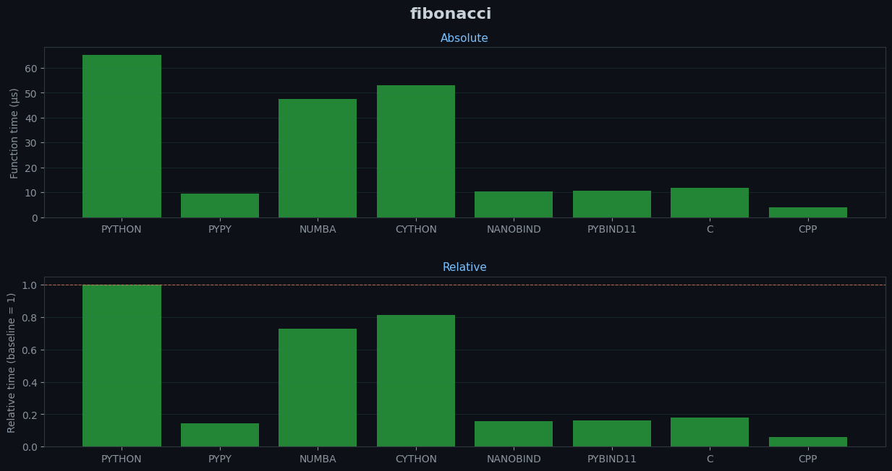
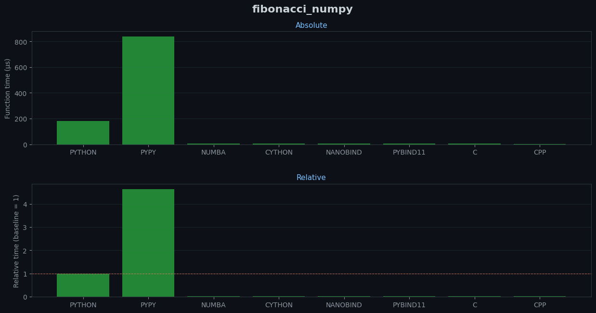
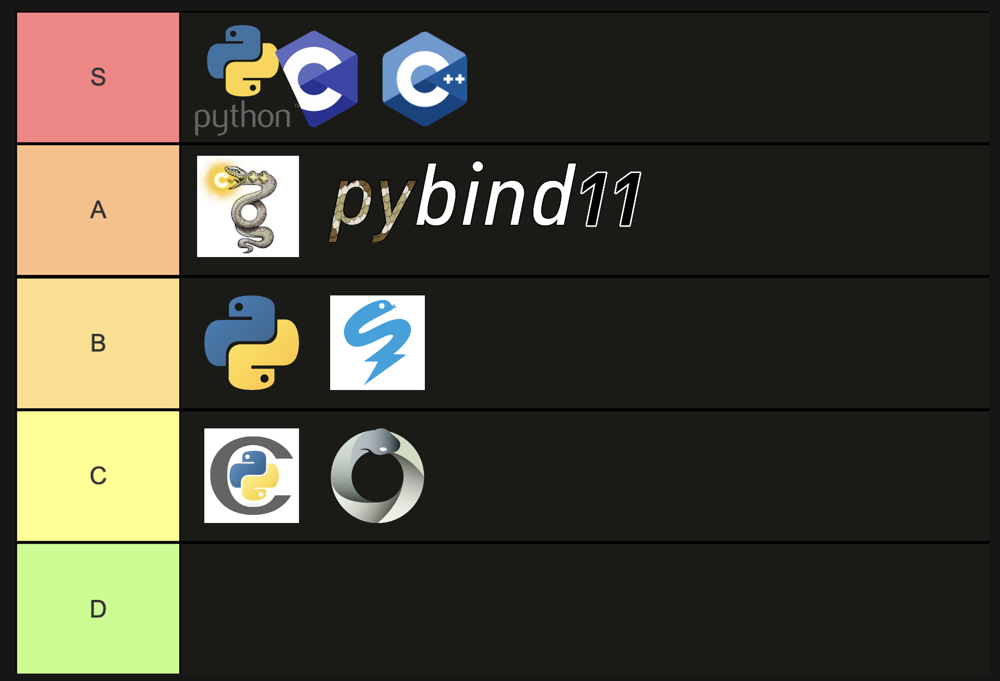

# Profiling Python C / C++ Extensions

This repo profiles tools used to improve the performance of python, determining which is the best for different use cases. 
The approaches profiled are:
1. Pure python
2. Cython
3. Numba
4. Pypy
5. Pybind11
6. Nanobind
5. C Python Package
5. C++

## Building and Running
### Cloning
Clone the repo recursively getting the extension libraries from respective repos.

```commandline
git clone --recurse-submodules https://github.com/conradstevens/python-binding-profiling.git
cd python-binding-profiling
```

### Building Compiled Packages and Wheels
Build and compile python wheels and libraries 
```commandline
just build  
```
```commandline
just profile-all  
```
## Results
The below results where profiled on a Thinkpad T16, with numpy using Blas and Lapac. 
Relative results plots are relative to the python run time.
### simple addition function

### Fibonacci like sequence over python list

### Fibonacci like sequence over python list using numpy

## Tier list
Influencing this list was the amount of effort, control and of course performance.    


## Test
To test the equivalence and proper reference properties of classes run:
```commandline
just test  
```